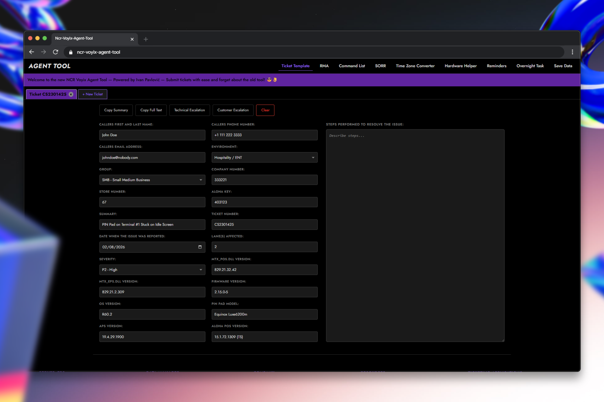
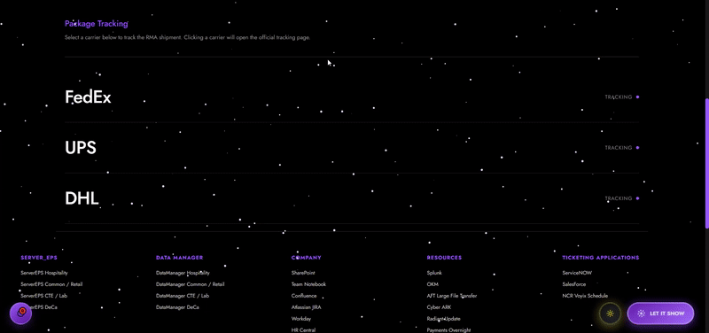

# NCR Voyix Agent Tool




React + Vite application for NCR Voyix support agents.

## Tech Stack

- React 18 + Vite 5
- GSAP 3 (animations)
- Custom hooks (clipboard, localStorage, tabs)
- GitHub API integration

## Quick Start

```bash
npm install
npm run dev
```

## Project Structure

```
ncr-voyix-agent-tool/
│
├── public/
│   ├── favicon/
│   ├── Images/
├── src/
│   ├── components/
│   │   ├── common/
│   │   │   ├── ConfirmModal.jsx
│   │   │   ├── CopyNotification.jsx
│   │   │   ├── GlobalReminders.jsx
│   │   │   └── Preloader.jsx
│   │   │
│   │   ├── layout/
│   │   │   ├── Header.jsx
│   │   │   ├── Footer.jsx
│   │   │   └── ScrollBanner.jsx
│   │   │
│   │   └── sections/
│   │       ├── TicketTemplate/
│   │       ├── RMA/
│   │       ├── Commands/
│   │       ├── Hardware/
│   │       ├── SORR/
│   │       ├── Timezone/
│   │       ├── Reminder/
│   │       ├── OvernightTask/
│   │       └── SaveData/
│   │
│   ├── data/
│   │   ├── commands.js
│   │   └── constants.js
│   │
│   ├── hooks/
│   │   ├── useClipboard.js
│   │   ├── useLocalStorage.js
│   │   └── useTabs.js
│   │
│   ├── utils/
│   │   ├── emailHelper.js
│   │   └── formatters.js
│   │
│   ├── styles/
│   │   ├── global.css
│   │   ├── variables.css
│   │   ├── themes.css
│   │   └── animations.css
│   │
│   ├── App.jsx
│   ├── App.css
│   ├── main.jsx
│   └── index.css
│
├── README.md
├── package.json
└── vite.config.js

```

## Key Features

### 1. Ticket Template

- Multi-tab system with state persistence
- Form with 20+ fields grouped logically
- Copy Summary/Full Text
- Email escalation (Technical/Customer)

### 2. RMA Section

- 18-field form for hardware returns
- Tracking integration (DHL, FedEx, UPS)
- Multiple copy formats

### 3. SORR Section

- Dynamic issue type handling
- Conditional field rendering
- Issue-specific notes/warnings

### 4. Commands

- 19 Windows commands
- Filter by type (info/network/system)
- One-click copy

### 5. Hardware Helper

- Image gallery (14 items)
- Filter by category

### 6. Timezone Converter

- Multi-timezone conversion
- DateTime picker

### 7. Save Data

- LocalStorage persistence
- Add/Delete with animations

## Custom Hooks

### `useClipboard`

```javascript
const { copyToClipboard, notification } = useClipboard();
// Returns: function + notification state
```

### `useLocalStorage`

```javascript
const [data, setData] = useLocalStorage("key", initialValue);
// Returns: [value, setter] with auto-sync
```

### `useTabs`

```javascript
const { tabs, activeTab, createTab, closeTab, switchTab } = useTabs();
// Returns: tab management functions
```

## Important Implementation Details

### Section Persistence

Components stay mounted but hidden (not unmounted) to preserve state:

```javascript
<div style={{ display: activeSection === "ticket" ? "block" : "none" }}>
  <TicketTemplate />
</div>
```

### Notification System

Each section manages its own notifications:

```javascript
const { copyToClipboard, notification } = useClipboard();
return (
  <>
    <CopyNotification notification={notification} />
    {/* section content */}
  </>
);
```

### Tab Creation Guard

Prevents double creation in React StrictMode:

```javascript
const isCreatingTab = useRef(false);
if (isCreatingTab.current) return;
```

## File Organization

- **Component CSS**: Co-located with JSX files
- **Path aliases**: `@components`, `@hooks`, `@utils`, `@data`, `@styles`
- **Formatters**: Centralized in `utils/formatters.js`

## Build

```bash
npm run build  # Output: dist/
npm run preview
```

## Deploy

```bash
# GitHub Pages
npm run build
# Push dist/ to gh-pages branch

# Vercel (recommended)
vercel --prod
```

## GitHub Integration

Footer includes live stats via GitHub API:

- Stars count
- Forks count
- Open issues

## Notes

- StrictMode removed to prevent double useEffect calls
- GSAP for smooth animations (preloader, transitions)
- All sections use consistent purple theme (#9968ff)
- Monospace font for code/technical fields

## License

Created by Ivan Pavlović for NCR Voyix
